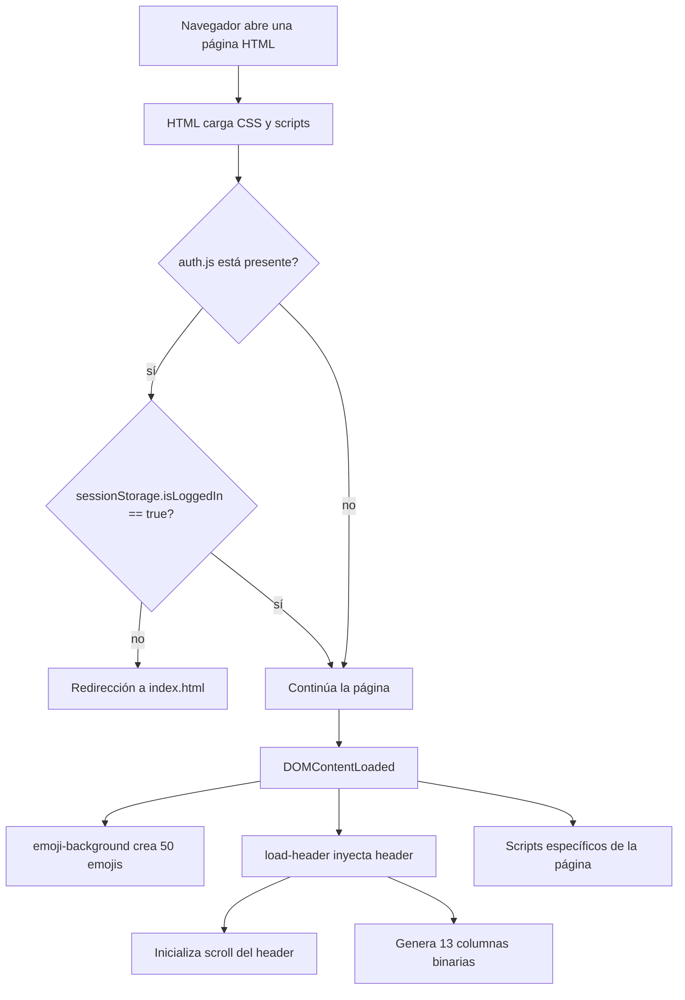
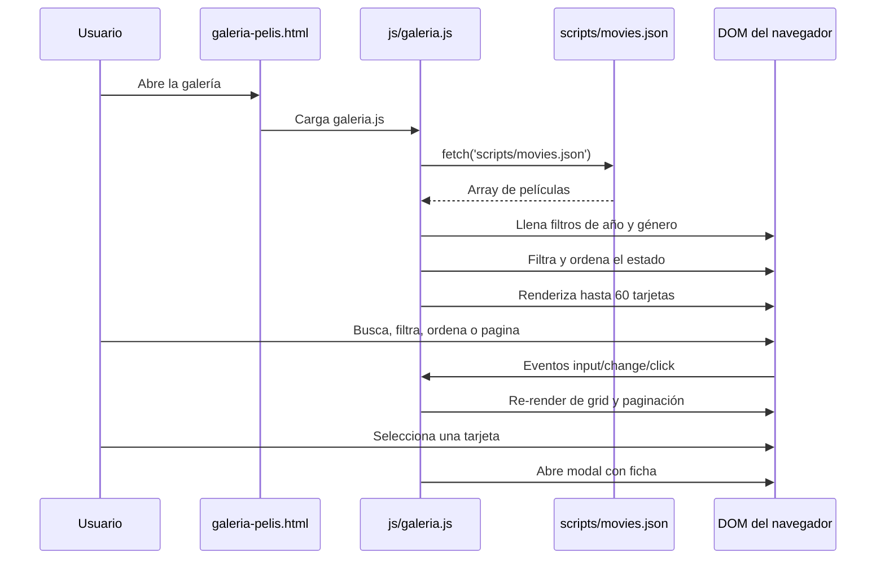
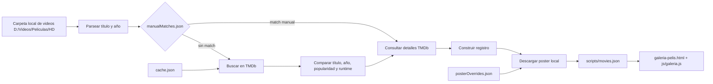
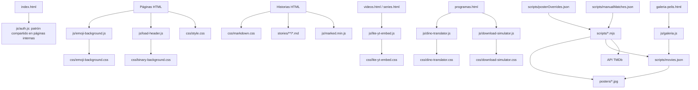

# Reporte de arquitectura del proyecto CHAC

## 1. Resumen ejecutivo

CHAC es un sitio web estático en español, publicado como un conjunto de archivos HTML, CSS, JavaScript, Markdown, imágenes y datos JSON. No existe un servidor de aplicación ni un proceso de build para el frontend: el navegador carga directamente los recursos desde el mismo repositorio. El despliegue esperado es compatible con GitHub Pages y con apertura local mediante un servidor estático.

La arquitectura actual combina cuatro estilos:

1. **Páginas HTML declarativas** para las secciones de historias, videos y videojuegos.
2. **Contenido Markdown cargado en el cliente** para varias historias.
3. **Componentes JavaScript autónomos** para fondos animados, autenticación de sesión, simulador de descargas, traductor Dino y reproductores YouTube ligeros.
4. **Un catálogo de películas dirigido por datos**, cuyo frontend consume `scripts/movies.json` y cuyo mantenimiento se realiza con scripts Node.js que consultan TMDb y descargan pósters.

El sistema funciona como una colección de páginas relacionadas, no como una aplicación SPA. La navegación completa provoca cambios de documento. La reutilización visual se obtiene enlazando las mismas hojas de estilo y ejecutando `js/load-header.js`, que inyecta el encabezado compartido.

### Diagnóstico arquitectónico

- **Punto fuerte:** pocos requisitos de ejecución, despliegue simple y separación razonable entre contenido editorial y código de catálogo.
- **Coste principal:** alta duplicación de HTML, referencias de recursos repetidas, contratos implícitos entre IDs/clases y scripts, y ausencia de una fuente única para navegación, autenticación o metadatos multimedia.
- **Riesgo crítico:** la contraseña está embebida en el JavaScript del navegador y la protección solo oculta/redirige páginas; no constituye control de acceso real.
- **Riesgo operativo:** hay una API key de TMDb escrita en varios scripts de mantenimiento y rutas locales absolutas dependientes de una máquina concreta.

---

## 2. Inventario de alto nivel

```text
/
├── *.html                         Entradas y páginas de contenido estático
├── header.html                    Plantilla de header no consumida automáticamente
├── css/                           Estilos globales y de componentes
├── js/                            Scripts de runtime del navegador
├── img/                           Imágenes editoriales, iconos y posters de secciones
├── posters/                       Pósters locales del catálogo cinematográfico
├── stories/                       Contenido editorial en Markdown
├── scripts/                       Datos y herramientas offline para el catálogo
├── duplicate_posters_report.md    Salida de análisis de pósters compartidos
├── unused_posters*.txt            Salidas/listas de análisis de recursos
└── .vscode/                       Configuración local de VS Code
```

### Entradas HTML

| Archivo | Responsabilidad | Particularidades |
|---|---|---|
| `index.html` | Portada | Login inline; contenido oculto hasta validar sesión; bienvenida e imagen `DHT.gif`. |
| `historias.html` | Índice editorial | Rejilla de enlaces a las historias y subsecciones. Usa `auth.js`. |
| `videos.html` | Índice de videos | Videos remotos y embeds YouTube ligeros. Usa `auth.js`. |
| `episodios.html` | Episodios completos | Elementos `<video>` con fuentes Dropbox y pósters locales. Usa `auth.js`. |
| `galeria-pelis.html` | Catálogo cinematográfico | Filtros, orden, paginación, modal y consumo de `movies.json`. No enlaza `auth.js`. |
| `mi_foza.html` | Historia personal | Carga un Markdown de `stories/foza/` mediante atributos `data-md`. |
| `mamita.html` | Historia personal | Misma familia de página Markdown/collapsible. |
| `informatica.html` | Historia temática | Historia Markdown y tarjetas colapsables. |
| `peliculas.html` | Historia sobre películas | Contenido editorial y Markdown. No es la galería de catálogo. |
| `series.html` | Historia sobre series | Contenido editorial, embeds YouTube y Markdown. |
| `musica.html` | Historia sobre música | Contenido editorial y Markdown. |
| `juguetes.html` | Historia sobre juguetes | Contenido editorial y Markdown. |
| `deporte.html` | Historia deportiva | Contenido editorial y Markdown. |
| `programas.html` | Experimentos | Simulador de descargas, traductor Dino y código inline adicional. |
| `videojuegos.html` | Índice de videojuegos | Categorías/plataformas y contenido Markdown. |
| `hist_var.html` | Historias varias | Contenido editorial y Markdown. |
| `header.html` | Fragmento de header | Referencia manual/plantilla; `load-header.js` no lo solicita mediante `fetch`. |

Las páginas de historia suelen repetir el mismo esqueleto: `head` con favicon y CSS, `auth.js`, un `main` con `story-full`, botón de retorno, `marked.min.js`, fondos, `load-header.js` y contenido Markdown. Las excepciones principales son la portada, la galería, los listados de videos/episodios y `programas.html`.

---

## 3. Runtime común del navegador

### 3.1 Inicialización típica



### 3.2 Header compartido: `js/load-header.js` y `header.html`

`load-header.js` es la fuente efectiva del encabezado en runtime:

- Espera `DOMContentLoaded`.
- Si ya existe un elemento `header`, termina sin modificarlo.
- Si existe `#protected-content`, inserta el header al principio de ese contenedor; de lo contrario lo inserta al principio de `body`.
- Detecta `window.location.hostname === 'danyhertiz.github.io'` y, solo en ese caso, antepone `/chac/` a los enlaces principales.
- Llama a `initializeHeaderScroll()` para añadir/quitar la clase `header-collapsed` cuando el usuario baja más de 20 píxeles.
- Llama a `initializeBinaryBackground()` después de insertar el header.
- Genera 13 columnas con 40 caracteres `0`/`1` aleatorios usando `innerHTML` con saltos de línea.

`header.html` contiene una versión estática equivalente, pero ningún script actual la carga. Esto crea dos fuentes de verdad para navegación y dificulta cambiar el header sin revisar ambos archivos.

### 3.3 Fondos animados

- `js/emoji-background.js` inserta un `.emoji-container` al principio del `body` y crea 50 elementos `.emoji-flake`. Usa los caracteres 🎮, 💾, 🎵 y 🛸, con tamaño, posición, duración, retraso y deriva horizontal aleatorios.
- `css/emoji-background.css` controla la apariencia y la animación de esos elementos.
- `js/snow-background.js` hace lo mismo con 50 copos (`❄`, `❅`, `❆`), pero no aparece referenciado por las páginas listadas; parece un módulo opcional o no conectado.
- `css/snow-background.css` acompaña al módulo de nieve.
- `js/load-header.js` crea el contenido binario, mientras `css/binary-background.css` define su posición y animación por columna.

Los tres fondos son efectos globales con coste de DOM y animación en cada página que los carga. No existe una configuración declarativa común para activarlos o desactivarlos por página.

### 3.4 Autenticación: `index.html` y `js/auth.js`

La portada implementa el login directamente en un `<script>` inline:

1. Comprueba `sessionStorage.getItem('isLoggedIn')`.
2. Si vale `true`, oculta el formulario y muestra `#protected-content`.
3. Si no, muestra `#login-container`.
4. Compara la contraseña introducida con el literal `fozolurdo`.
5. Si coincide, escribe `isLoggedIn = 'true'` en `sessionStorage`.
6. Si falla, muestra el mensaje y aplica una animación `shake` creada dinámicamente.

Las páginas internas que enlazan `js/auth.js` ejecutan una comprobación inmediata. Si la clave de sesión no vale `true`, redirigen a `index.html`; en GitHub Pages usan `/chac/index.html`, y en local usan `index.html`.

Esto es **control de navegación, no autenticación segura**: cualquiera puede leer la contraseña en el código fuente, escribir la clave en DevTools o abrir directamente los recursos estáticos. Todo el contenido y las URLs remotas quedan publicados. Una refactorización que requiera privacidad debe mover la autorización a un servidor o proveedor de identidad y proteger los datos en origen.

### 3.5 Markdown

`js/loadMarkdown.js` implementa un cargador genérico:

- Lee `?post=` de la URL.
- Conserva solo el último segmento y caracteres alfanuméricos, guion, guion bajo y punto.
- Garantiza la extensión `.md`.
- Intenta cargar `stories/<archivo>` y usa `prueba.md` como fallback.
- Convierte el texto con `marked.parse()` y lo inyecta en `#content`.

El parser real es `js/marked.min.js` (Marked v15.0.12, distribución vendorizada). Las páginas no forman un router central: varias tienen scripts inline que recorren `[data-md]`, construyen una ruta fija por carpeta y hacen `fetch` del Markdown. Esa variante no usa `loadMarkdown.js`.

La sanitización de `?post` limita el nombre de archivo, pero el HTML producido por Markdown se inserta con `innerHTML`. Como los Markdown son archivos locales controlados por el proyecto, el riesgo depende de quién pueda modificarlos; si en el futuro el contenido pasa a ser editable o externo, debe añadirse sanitización HTML explícita.

### 3.6 Video y YouTube

`js/lite-yt-embed.js` define el elemento personalizado `<lite-youtube>`:

- Muestra una miniatura en lugar de crear el iframe completo inmediatamente.
- Añade botón de reproducción y atributos de accesibilidad.
- Prefetch/preconnecta dominios de YouTube.
- Carga la API de iframe de YouTube cuando se solicita reproducción.
- Inserta el iframe `youtube-nocookie.com` al activarse.

`css/lite-yt-embed.css` contiene el estilo del componente. `videos.html` y `series.html` lo utilizan; `episodios.html` lo carga aunque su contenido visible usa `<video>` y Dropbox, por lo que allí parece una dependencia sobrante.

---

## 4. Arquitectura de las páginas de contenido

### Índice de historias

`historias.html` es un índice estático compuesto por enlaces `.story-card-link`, cada uno con imagen, título y descripción. Apunta a:

- `mi_foza.html`
- `mamita.html`
- `informatica.html`
- `peliculas.html`
- `series.html`
- `galeria-pelis.html`
- `episodios.html`
- `videojuegos.html`
- `musica.html`
- `juguetes.html`
- `programas.html`
- `deporte.html`
- `hist_var.html`

Es una navegación codificada manualmente: no se genera desde un manifiesto ni comparte datos con el header.

### Plantilla editorial repetida

Las páginas de historias usan principalmente:

- `.story-full` para artículo completo.
- `.collapsible-story` para bloques expandibles.
- `data-md` para indicar el archivo Markdown.
- `marked.min.js` para convertir Markdown a HTML.
- `css/markdown.css` para el contenido generado.
- `css/collapsible-cards.css` para las tarjetas interactivas.
- Botones inline con `onclick` para volver a `historias.html`.

El contenido fuente vive en `stories/`, dividido por tema: `deporte`, `foza`, `informatica`, `juguetes`, `mamita`, `musica`, `peliculas`, `series`, `varias` y `videojuegos`. La estructura de carpetas de Markdown funciona como una taxonomía editorial, pero la asociación página-carpeta está implementada en cada HTML.

### Páginas multimedia

- `videos.html` combina tarjetas de video, embeds YouTube y fuentes externas. Utiliza `lite-youtube` para diferir la carga de iframes.
- `episodios.html` contiene una lista grande de `<video controls preload="none">`, cada uno con un poster local y un `<source>` Dropbox. Los archivos de video no están en el repositorio.
- Los enlaces de Dropbox son parte del HTML y dependen de tokens/URLs externas que pueden expirar, cambiar o ser bloqueadas por tráfico.

### `programas.html`

Es la página más parecida a un mini laboratorio de componentes:

1. **Simulador de descarga**, marcado por `#download-simulator`.
2. **Traductor Dino**, montado por `initDinoTranslator('dino-translator')`.
3. Un script inline para `.collapsible-story` y otro cargador Markdown que busca `stories/musica/` en elementos `[data-md]`.

`js/download-simulator.js` se detiene si no encuentra el contenedor, guarda el tema en `localStorage` bajo `ds-theme`, soporta `modern`, `vista` y `mac2000`, y anima siete velocidades desde 56 Kbps hasta 10 Gbps con `requestAnimationFrame`. Convierte KB/MB/GB/TB a MB, calcula el tiempo estimado y recalcula los bloques visuales al redimensionar.

`js/dino-translator.js` expone globalmente `toDino`, `toEnglish` e `initDinoTranslator`. Es una sustitución de letras, no una traducción lingüística reversible; monta sus controles dinámicamente y carga `css/dino-translator.css` si no encuentra el enlace exacto.

Hay código inline de carga Markdown en `programas.html` aunque en la estructura visible no se aprecia un bloque `[data-md]` correspondiente. Debe considerarse código potencialmente muerto o una dependencia de contenido que se eliminó.

---

## 5. Galería de películas

### Flujo de ejecución



`galeria-pelis.html` define el contrato DOM que `js/galeria.js` espera:

- `#search-input`
- `#genre-filter`
- `#year-filter`
- `#sortSelect`
- `#toggleFilters`
- `#filtersContainer`
- `#resultsCount`
- `#movies-grid`
- `#pagination-controls`
- `#movie-modal` y sus elementos internos

`js/galeria.js` mantiene un estado global con catálogo completo, resultados filtrados, página actual, texto de búsqueda, género, año y orden. Sus reglas principales son:

- 60 elementos por página.
- Búsqueda por título localizado u original, aunque la búsqueda usa el título mostrado disponible.
- Filtros exactos de año y género.
- Orden por año, título o duración.
- Paginación adaptada a móvil: tres números visibles; escritorio: cinco.
- Modal accesible parcialmente: `role=dialog`, `aria-hidden`, cierre por Escape, botón y clic sobre el overlay.
- Placeholder SVG data URI y recuperación ante error de imagen.
- `loading="lazy"` para los pósters.

La galería no reproduce archivos de video; solo representa metadatos y carteles. `sourceFile` existe en los registros, pero no se muestra ni se usa para reproducir la película.

### Contrato de `movies.json`

Cada registro normalmente contiene:

```json
{
  "title": "Título en español",
  "originalTitle": "Original title",
  "year": "1999",
  "overview": "Sinopsis localizada",
  "originalOverview": "Sinopsis alternativa",
  "poster": "posters/4951.jpg",
  "genres": ["Comedia", "Romance"],
  "tmdbId": 4951,
  "runtime": 98,
  "sourceFile": "Título (1999).mkv",
  "parsedTitle": "Título",
  "parsedYear": "1999"
}
```

El frontend tolera `poster`, `runtime`, `genres`, `tmdbId` y títulos ausentes mediante fallbacks, pero no existe un esquema validado antes de renderizar. La consistencia depende de los scripts offline y de edición manual.

---

## 6. Pipeline offline del catálogo

Los scripts están en `scripts/`, usan módulos ES (`"type": "module"`) y dependen de `fs-extra` y `node-fetch`. `scripts/package.json` no define comandos operativos: solo contiene un `test` placeholder que termina con error.



### `generateMovies.mjs`

Es el generador más completo y el origen conceptual del formato:

- Escanea videos `.mp4`, `.mkv` y `.avi` desde una ruta local fija.
- Extrae título/año con la expresión `^(.*)\((\d{4})\)`.
- Calcula duración con `ffprobe`.
- Normaliza texto eliminando acentos y caracteres especiales.
- Consulta TMDb y puntúa coincidencias por títulos, año, popularidad, documentales y palabras sospechosas.
- Añade ajuste de puntuación por duración local frente a TMDb.
- Usa `manualMatches.json` y `posterOverrides.json`.
- Mantiene una caché en `cache.json` según el flujo implementado en el resto del archivo.
- Escribe objetos con sinopsis, géneros, IDs, duración, archivo origen y poster local.

La API key está hardcodeada. La carpeta de videos y algunas salidas son relativas al directorio actual, por lo que ejecutar desde otra ubicación puede escribir/leer archivos distintos de los esperados.

### `updateNewMovies.mjs`

Añade únicamente archivos nuevos a un catálogo existente:

- Compara `sourceFile` para detectar novedades.
- Lee matches manuales, caché y overrides.
- Mide runtime con `ffprobe`.
- Prueba búsqueda con año, sin año y título limpiado.
- Puntúa resultados y valida los mejores candidatos consultando detalles para comparar duración.
- Selecciona posters en español, sin idioma o de otros idiomas, priorizando valoración, votos y tamaño.
- Agrega fallbacks cuando no existe match.
- Actualiza `movies.json` sin regenerar todo el catálogo.

Es una evolución paralela de `generateMovies.mjs` y comparte lógica duplicada en vez de importar una biblioteca común.

### `updateCatalog.mjs`

Es una variante más simple de actualización incremental:

- Lee el catálogo existente.
- Detecta archivos de video nuevos.
- Busca primero con título y año en TMDb.
- Obtiene detalles y descarga el poster si no existe.
- Evita duplicados por `sourceFile` y por título normalizado + año.

Su implementación no tiene la misma lógica avanzada de matches manuales, runtime, selección de poster ni caché que `updateNewMovies.mjs`, por lo que ambos scripts pueden producir resultados distintos.

### `processManualMatches.mjs`

Procesa explícitamente `manualMatches.json`:

- Interpreta valores numéricos como películas y objetos `{id, type}` como película o serie.
- Consulta directamente `/movie/<id>` o `/tv/<id>` en TMDb.
- Descarga el poster.
- Actualiza un registro por `tmdbId` o por título normalizado, o inserta uno nuevo.
- Conserva campos existentes cuando el nuevo valor está vacío.

Es la vía adecuada para corregir asociaciones ambiguas, pero debe revisarse la ausencia de `sourceFile`, `parsedTitle` y `parsedYear` en los registros que inserta desde cero.

### `datosfaltantes.mjs`

Completa registros con `tmdbId` vacío:

- Identifica entradas incompletas.
- Usa matches manuales, soportando tipo `movie` y `tv`.
- Busca en TMDb si no hay match manual.
- Recupera detalles, poster, género, año, títulos, overview y runtime.
- Actualiza el registro existente y escribe el JSON.

El nombre sugiere una herramienta de reparación de datos, no una etapa necesaria para el frontend.

### `limpiarduplicados.mjs`

Agrupa registros por `tmdbId`, puntúa calidad de cada duplicado según poster, overview, géneros, runtime, overview original y `sourceFile`, conserva el de mayor puntuación y escribe `movies.cleaned.json`. Aunque define `DRY_RUN = false`, nunca sobrescribe el JSON original: la salida prevista es el archivo limpio separado.

### `addRuntime.mjs`

Asigna duraciones desde un mapa manual indexado por `movie.title`. Si no encuentra una duración y el valor es falsy, escribe `runtime: 0`. Es útil como corrección puntual, pero el mapa es frágil frente a cambios de título, acentos, mayúsculas o nombres localizados.

### Análisis de posters

- `analyze_posters.py` compara IDs de `movies.json` con los nombres de archivo en `posters/` y produce conteos/listados de faltantes y no usados en la salida estándar.
- `generate_duplicate_report.py` agrupa películas por la misma ruta `poster` y escribe `duplicate_posters_report.md`.
- `unused_posters.txt` y `unused_posters_final.txt` son resultados derivados, no entradas de runtime.

---

## 7. CSS y sistema visual

### `css/style.css`

Es la hoja global. Define variables base, `body`, header, navegación, cards, contenido editorial, tarjetas de historias, videos, `.story-full`, layout principal y media queries. Es consumida por prácticamente todas las páginas.

### Hojas especializadas

| Hoja | Consumidor/función |
|---|---|
| `binary-background.css` | Header y columnas binarias creadas por `load-header.js`. |
| `emoji-background.css` | Fondo de emojis creado por `emoji-background.js`. |
| `snow-background.css` | Fondo de nieve opcional, sin referencias HTML observadas. |
| `collapsible-cards.css` | Historias con bloques expandibles. |
| `markdown.css` | HTML producido por Marked. |
| `lite-yt-embed.css` | Elemento `<lite-youtube>`. |
| `galeria.css` | Controles, grid, modal, tarjetas, filtros y paginación de películas. |
| `download-simulator.css` | Temas y barras del simulador. |
| `dino-translator.css` | Controles y salida del traductor Dino; también puede cargarse dinámicamente. |

El estilo global convive con estilos inline repetidos en botones, márgenes y videos. Esto hace que una refactorización visual tenga que buscar reglas en tres niveles: CSS global, CSS de componente y atributos `style`/handlers inline.

---

## 8. Relaciones entre archivos



### Dependencias externas

- TMDb API para metadatos y posters durante mantenimiento offline.
- `image.tmdb.org` como origen consultado por las herramientas, aunque los posters terminan normalmente en `posters/`.
- YouTube y `youtube-nocookie.com` para embeds.
- Dropbox para videos de episodios y algunos videos remotos.
- `ffprobe` instalado en la máquina que ejecuta generadores de catálogo.
- Node.js con dependencias de `scripts/package.json` para mantenimiento.

---

## 9. Problemas y riesgos para una refactorización

### Prioridad alta

1. **Secreto y contraseña expuestos.** La contraseña de la portada y la API key TMDb están en código distribuido o versionado.
2. **La protección no protege archivos.** GitHub Pages y cualquier servidor estático entregan HTML, Markdown, JSON, imágenes y URLs aunque el usuario no pase por el login.
3. **Duplicación de fuentes de verdad.** Header, navegación, botones de retorno, estructura de páginas, carga Markdown y lógica de catálogo están copiados entre archivos.
4. **Pipeline no reproducible.** Las rutas `D:/Videos/Peliculas/HD`, `./movies.json`, la dependencia de `ffprobe`, la API externa y la ausencia de scripts npm hacen que los resultados dependan del directorio y equipo de ejecución.
5. **Datos sin esquema.** No hay validación formal de `movies.json`; distintos scripts pueden omitir campos o tratar películas/series de manera distinta.

### Prioridad media

1. **Dependencias no conectadas o ambiguas:** `header.html`, `snow-background.js`, `snow-background.css`, `js/loadMarkdown.js` y posiblemente parte del código inline de `programas.html`.
2. **Carga de scripts inconsistente:** mezcla de scripts normales, `defer`, handlers inline y listeners `DOMContentLoaded`.
3. **Mantenimiento costoso de contenido:** cada historia es una página HTML que asocia manualmente su carpeta, estilos, navegación y scripts.
4. **Integración externa frágil:** enlaces Dropbox con tokens embebidos pueden fallar sin que exista fallback o estado visible consistente.
5. **Accesibilidad incompleta:** modal y controles tienen algunos atributos útiles, pero la navegación, los botones inline, el foco del modal y la semántica de contenido requieren una revisión integral.
6. **Riesgo de XSS futuro:** Markdown se convierte a HTML sin sanitización adicional y la galería usa `innerHTML` para ciertos textos/metadatos.

### Prioridad baja

1. Errores tipográficos y variaciones de idioma en textos visibles.
2. Fecha de copyright fija en 2025.
3. Estilos inline con valores repetidos y un `font` Arial que contradice la hoja global.
4. Artefactos de análisis y backups en la raíz que pueden confundirse con fuentes de producción.

---

## 10. Propuesta de refactorización por etapas

### Etapa 1: estabilizar sin cambiar la experiencia

- Crear un esquema de catálogo y validar `movies.json` en cada proceso.
- Mover la configuración del pipeline a un archivo de configuración o variables de entorno.
- Retirar la API key del código versionado y rotarla si ya fue expuesta.
- Documentar comandos reproducibles en `scripts/package.json`.
- Eliminar o marcar explícitamente módulos no usados.
- Centralizar constantes de rutas, host de despliegue y enlaces de navegación.

### Etapa 2: reducir duplicación

- Convertir el header, footer, navegación y botón de retorno en una plantilla generada.
- Crear un manifiesto de páginas con título, categoría, imagen, descripción y Markdown asociado.
- Generar las páginas editoriales a partir del manifiesto o migrarlas a un framework estático.
- Sustituir handlers `onclick` y estilos inline por clases y listeners centralizados.

### Etapa 3: ordenar el runtime frontend

- Definir un bootstrap común para autenticación, header, fondos y componentes opcionales.
- Usar módulos ES y una inicialización explícita por página.
- Mantener los fondos como componentes configurables o reducirlos en dispositivos con `prefers-reduced-motion`.
- Añadir validación, estados de carga, error y vacío para Markdown, videos y galería.

### Etapa 4: decidir el modelo de privacidad

- Si el sitio seguirá siendo público: retirar la falsa promesa de protección y tratar el login como personalización visual.
- Si el contenido debe ser privado: usar backend/hosting con autenticación real, autorización de recursos y almacenamiento protegido. El frontend estático actual no puede resolver esto por sí solo.

### Etapa 5: evolucionar el catálogo

- Extraer una biblioteca común para normalización, búsqueda TMDb, selección de poster y escritura de registros.
- Elegir un único flujo entre `generateMovies.mjs`, `updateCatalog.mjs` y `updateNewMovies.mjs`.
- Mantener `manualMatches` y overrides como entradas versionadas, pero validar IDs y tipos.
- Separar claramente fuentes (`sourceFile`), metadatos TMDb y presentación.
- Automatizar comprobaciones de posters, duplicados, campos faltantes y enlaces rotos antes de publicar.

---

## 11. Contrato recomendado para una futura arquitectura

Una refactorización debería conservar una separación explícita:

```text
Contenido editorial
  -> manifiesto de páginas
  -> Markdown
  -> renderer estático

Catálogo audiovisual
  -> fuente local de videos
  -> normalización/matching TMDb
  -> JSON validado + assets de posters
  -> componente de galería

Runtime compartido
  -> layout/header/footer
  -> navegación
  -> accesibilidad
  -> preferencias visuales
  -> autenticación real, si aplica
```

El límite más importante es no mezclar la preocupación de "qué contenido existe" con "cómo se pinta una página". Actualmente `movies.json` está razonablemente separado del frontend, pero las historias, la navegación y los componentes interactivos todavía están acoplados a cada documento HTML.

## 12. Conclusión

El proyecto es pequeño en infraestructura pero amplio en superficie editorial y multimedia. Su modelo actual es adecuado para publicación estática personal, siempre que se acepte que el contenido es público y que el mantenimiento manual forma parte del flujo. Para una refactorización completa, la mayor ganancia no vendrá de convertirlo inmediatamente en una SPA, sino de establecer primero fuentes de datos únicas, plantillas compartidas, contratos validados y un pipeline de catálogo reproducible. Después de eso será posible elegir con criterio entre un generador estático, un framework como Astro/Eleventy o una aplicación con backend, según si la prioridad es reducir duplicación, mejorar edición o proteger contenido.
